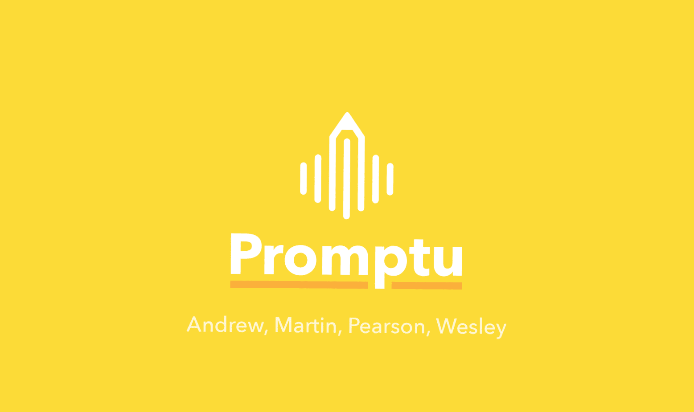

# Promptu

  

## Inspiration

For the TOHacks-2019 Hackathon, my team and I decided to take on the challenge of bringing light to certain social issues. Instead of tackling one social issue, we decided to tackle all of them. Behold Promptu, the social platform for raising awareness using natural language processing and a unique dataset called Quick Draw by Google.

## What it does

## How we built it

## Challenges we ran into

## Accomplishments that we are proud of

## What we learned

## What's next for Promptu

